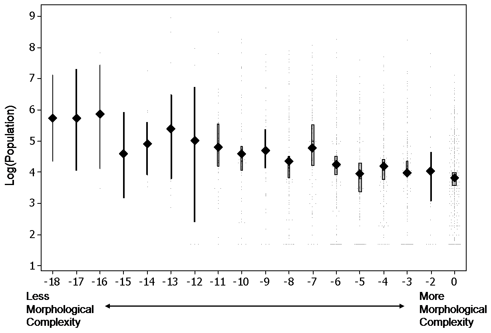

*As per usual, do the reading, and then take the quiz on Canvas to test your understanding and/or flag up any questions you'd like me to address in class.*

In class 2 we discussed how a symbolic, phonemic, compositional language can emerge as a result of cultural transmission. In class 3 we are going to look at a bit of a grab-bag of topics, including starting to think about the cognitive prerequisites required to get the iterated learning process up and running - this will lead naturally into class 4, where we look for those prerequisites in other animals, particularly our closest living relatives, to try to understand the evolutionary history of those capacities. But the other thing we'll look at in class 3 is how differences in communicative or learning pressures cause languages transmitted by iterated learning to evolve in different directions, and this is the topic the prepatatory reading is on.

 The central claim of this course is that linguistic structure is a consequence of languages evolving under pressures from learning and use, with the structural features of languages reflecting trade-offs between those pressures. One corollary of this perspective is that languages whose users have different communicative needs, or who are under different learning pressures, or who are subject to different production or perceptual pressures, will adapt to those requirements, leading languages to diverge in at least some of their details as they adapt to these different constraints and needs. In other words, it seems possible that not all cross-linguistic variation is arbitrary and reflective of independent historical pathways travelled by different languages; some of it might reflect different adaptations by different languages to differing linguistic niches. 

One well-known example of this sort of claim is the idea that languages spoken in larger populations, with more non-native speakers, might be sysnetaically different from languages spoken in smaller populations where everyone is exposed to the language from birth. These ideas have been advanced e.g. in Trudgill (2011) and Wray & Grace (2009), and have received some empirical support (see e.g. Lupyan & Dale, 2010; Bentz & Winter, 2013; Koplenig, 2019) - for example Lupyan & Dale (2010) find that languages spoken in larger populations with more non-native speakers tend to have simpler morphology (they are more likely to be isolating rather than fusional, have fewer case distinctions, fewer grammatical categories marked on the verb, less complex verbal agreement, and so on). The graph below shows the relationship between population size and their omnibus measure of morphological complexity ([consult their caption for more explanation of the plot](https://doi.org/10.1371/journal.pone.0008559.g003)).

It's also important to note that, at the very least, this correlation depends on how you measure morphological complexity and demographic features of populations, and there are several analyses that use different measures and different analytic approaches that report no relationship (e.g. Koplenig, 2019; Shcherbakova et al., 2023)!

Nothwithstanding that caveat, there are a couple of prominent theories in the literature offering possible mechanisms which could generate this correlation - i.e. how might different population size or proportion of non-native speakers lead to different pressures acting on languages during their learning and use, and why would this affect morphological complexity? One idea, that I plan to talk about in the lecture, is that languages with more non-native speakers are under a more severe learning pressure than languages with fewer or no non-native speakers, which leads to those languages avoiding hard-to-learn features (specifically, complex morphology). The set reading for today, [Raviv et al. (2019)](http://dx.doi.org/10.1098/rspb.2019.1262) offers a slightly different account, specifically that the difficulty of converging linguistically with more individuals favours simpler, more regular, more transparent encoding of meaning in form. If you are not a stats person feel free to gloss over the details of the measures and stats and rely on the graphs and the authors' summary of the main findings; you can also ask questions in the quiz and/or in class!

## References

Bentz, C., & Winter, B. (2013). Languages with More Second Language Learners Tend to Lose Nominal Case. *Language Dynamics and Change, 3,* 1-27.

Koplenig, A. (2019). Language structure is influenced by the number of
speakers but seemingly not by the proportion of non-native speakers. *Royal
Society Open Science, 6,* 181274.

Lupyan, G., & Dale, R. (2010). Language structure is partly determined by social structure. *PLOS ONE, 5,* e8559.

Raviv, L., Meyer, A., & Lev-Ari, S. (2019). Larger communities create more systematic languages. *Proceedings of the Royal Society B: Biological Sciences, 286,* 20191262. [Link](http://dx.doi.org/10.1098/rspb.2019.1262)

Shcherbakova, O., Michaelis, S. M., Haynie, H. J., Passmore, S., Gast, V., Gray, R. D., Greenhill, S. J., Blasi, D. E., & Skirgård, H. (2023). Societies of strangers do not speak less complex languages. *Science Advances, 9,* eadf7704.

Trudgill, P. (2011). Sociolinguistic Typology: Social Determinants of Linguistic Complexity. Oxford: Oxford University Press.

Wray, A., & Grace, G. W. (2007). The consequences of talking to strangers: Evolutionary corollaries of socio-cultural influences on linguistic form. *Lingua, 117,* 543-578.

## Re-use

All aspects of this work are licensed under a [Creative Commons Attribution 4.0 International License](http://creativecommons.org/licenses/by/4.0/).
