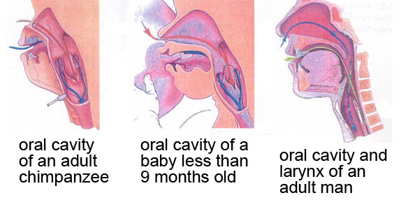
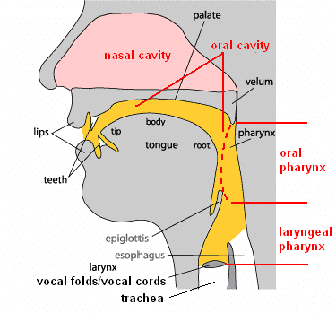
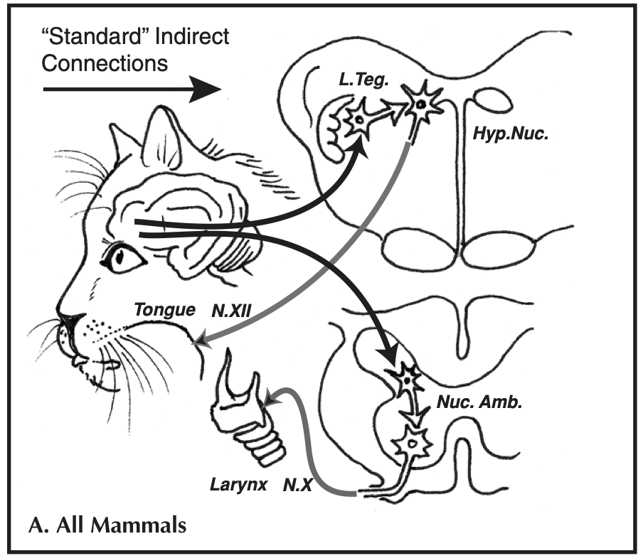
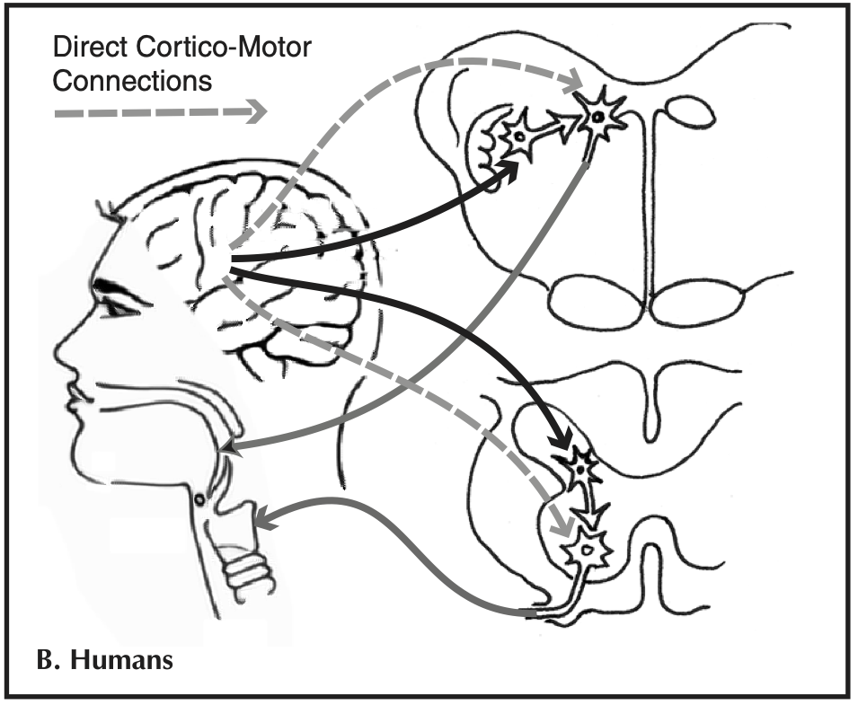

*As usual, do the reading - quite a lot to get through today, a short paper and a long blog today - and then take the quiz on Canvas to test your understanding.*

Up to this point we have focussed on cultural evolution - the adaptation by languages to pressures operating on them during the cycle of learning and use - as the primary explanatory mechanism for linguistic structure. Now we'll turn back to the capacities underpinning cultural transmission - what cognitive capacities must humans have in order to set this cultural evolutionary process working, and what can we infer about the evolution of those capacities in our species? We will take a comparative approach to this question, looking at related capacities in non-human animals. 

In the lecture I will focus mainly on the comparative psychology of grammar learning (which might give us some insights into the evolution of the human capacities in that domain): the reading provides relevant background information on the comparative approach (what we can learn about human evolution by studying other animals), some preliminaries on the evolution of the vocal tract, and a bit about vocal learning (as involved in learning speech in humans), which I will only touch on briefly in class. The journal article to read is [Fitch (2019)](http://dx.doi.org/10.1098/rstb.2019.0046)**, which provides a brief survey of the experimental evidence on the conceptual and communication systems of non-human animals. In particular, Fitch discusses the mismatch between the relatively rich mental lives of non-human animals, and the comparatively impoverished nature of their communication systems: they have mental concepts that they cannot communicate. You can jump into that once you've read my little summary of the comparative method.

## The comparative method

We'll take a *comparative* approach to the evolution of the cognitive capacities underpinning the cultural transmission of language: comparing the abilities of multiple species in order to understand the evolution of these capacities in humans. If you have studied any historical linguistics then the comparative method in biology will be pretty familiar to you -- linguists have been comparing across languages to figure out what ancestral languages look like, and how languages change, for 200+ years. But if you are unfamiliar with the comparative method from linguistics, you might be wondering: why would studying other apes, monkeys or even whales or birds be useful to understanding human evolution?

All life on earth shares a [common ancestor](https://en.wikipedia.org/wiki/Last_universal_ancestor): if you trace your parents' parents' parents' parents' parents' ... back far enough (over 3 billion years) you'll come to an organism (a very simple, single-cell affair) who is your ancestor, but also the ancestor of all other humans, all other primates, all other mammals, in fact of all living things on the planet (including all plants, all bacteria and so on). Similarly, if you go back less far in time you can find the last common ancestor of all animals, or [all mammals](https://institutions.newscientist.com/article/dn23148-meet-our-last-common-mammalian-ancestor/), or [all humans](https://en.wikipedia.org/wiki/Most_recent_common_ancestor#TMRCA_of_all_living_humans) (the person who is the great great great great ... grandparent of all living humans). This is because evolution produces a branching tree of life: populations split, become separated, and eventually accumulate so many changes (including adaptations) that they becomes separate species; those daughter species die out or in turn split into further daughter species, which die off or further split, and so on.

Humans are just one leaf of this vast and bushy tree of life, which means that we share varying degrees of relatedness to all the other living things on the planet: the species most closely related to us are now extinct ([you can see some of them here](http://humanorigins.si.edu/evidence/human-family-tree), but our closest living relatives are [the other hominids](https://en.wikipedia.org/wiki/Hominidae): chimps, gorillas, and orangutans. For example, [our last common ancestor with chimpanzees (the individual who was a great great great ... grandparent of all humans and all chimpanzees) lived around 6 or 7 million years ago](http://www.sci-news.com/othersciences/anthropology/science-homo-pan-last-common-ancestor-03220.html). We are more distantly related to all other mammals, all other animals, and ultimately (by tracing our way back to our common ancestor) all other living things.

You will probably have noticed many similarities between humans and other hominids (most obviously chimps) -- for starters, they look a lot like us, and many of their social behaviours are reminiscent of the way we behave. [This is because we share many of their genes](http://www.amnh.org/exhibitions/permanent-exhibitions/human-origins-and-cultural-halls/anne-and-bernard-spitzer-hall-of-human-origins/understanding-our-past/dna-comparing-humans-and-chimps/), passed on from parent to child all the way back to our shared ancestral population. Traits shared between species through common ancestry are known as *homologies*, and there are homologous traits between even distantly related species -- for example, if you know where to look there are fairly obvious homologies in [the structure of forelimbs in humans, dogs, whales and birds](https://upload.wikimedia.org/wikipedia/commons/5/5e/Homology_vertebrates-en.svg), in the way in which development works in related species, or in the genes encoding proteins like haemoglobin.

This is useful if you are trying to reconstruct the evolutionary history of a trait or ability, because by comparing across closely-related species you can make guesses about what the common ancestor of those species looked like, and how the daughter species diverged. For example, the similarities between humans and other apes (in the shape of our bodies, our social and communicative behaviours) presumably reflect our shared ancestry: the simplest explanation for these shared traits is that we all inherited them from our common ancestral species. Differences between us therefore must have developed after this point of common ancestry, in response to different pressures acting on our species since we separated and occupied different environments and different ecological niches.

Investigating the cognitive capacities of other apes therefore provides insights into the evolutionary history of our own species, because it allows us to infer what our ancestral species looked like, how we have changed since then, and what selective pressures might have driven those changes. For instance, to understand the evolutionary history of language in our species, we'll need to try to figure out what kind of communication systems our ancestral species had (was it a lot like language, or a lot different?), and what selective pressures drove the evolution of the capacity for language in our species but not in closely related species (what were the survival and reproductive pressures made us evolve in the unique way we did?).

The more closely related two species are, the more homologous traits they will share. But studying distantly-related species can also be useful, because of **convergent evolution**, the process by which distantly-related species find similar solutions to similar survival or  reproductive challenges. [Consider the wings of birds and bats](http://evolution.berkeley.edu/evolibrary/article/evo_09). They look similar (at least superficially) and serve the same function (enabling flight), but we know that this similarity is extremely unlikely to be due to descent from a common ancestor (bats and birds are only distantly related, and most of the other species that share the same common ancestor don't have wings, which makes it unlikely that the common ancestor of bats and birds did). This means that flight must have independently evolved in bats and birds -- natural selection discovered the same solution to the same set of environmental challenges (how to avoid predators and/or exploit hard-to-reach food sources) in two separate groups of animals. This is convergent evolution, and it produces **analogies** -- traits that are similar not due to common descent, but to shared selection pressures. Studying analogous traits provides insights into the selective pressures that lead to the evolution of a particular behaviour or ability. For instance, in the case of language, if we could find an analogous trait in another species, we could try to figure out (by comparing these two species) what environmental or social challenges they share that might have lead to convergent evolution of the language-relevant ability in both
species.

## Fitch (2019)

Now you can read [Fitch (2019)](http://dx.doi.org/10.1098/rstb.2019.0046), which provides a brief summary of concepts in non-human animals. The general conclusion is that nonhuman animals demonstrate an impressive array of complex cognitive abilities, which aren't reflected in their communication systems. This has two important implications. First, much of this sophisticated cognition is possible in the absence of language, and presumably preexisted the emergence of the ability to externalise these rich mental lives in humans. Second, many capabilities which were previously thought to be uniquely human have been found in nonhuman animals; Fitch focuses on concepts, but the same is true of other sophisticated behaviours like tool use. 

In contrast to the rich internal cognitive world of animals, Fitch argues that their communication systems are relatively impoverished when compared with the apparent richness of their mental lives, and very clearly when compared to human language. Animal communication systems do however show a great degree of variety in their richness and complexity. For instance, the bengalese finch is capable of producing song with relatively elaborate structures, but which is restricted in its function and lacks propositional content:

<!-- [embed]https://www.youtube.com/watch?v=rozh349EZWA[/embed] -->
<iframe width="560" height="315"
src="https://www.youtube.com/embed/rozh349EZWA"
allow="accelerometer; autoplay; encrypted-media; gyroscope; picture-in-picture"
allowfullscreen></iframe>

Various non-human animals are also flexible vocal learners, and we will return to vocal learning below. One of the most entertaining examples is the Lyrebird, which is hilariously brilliant at mimicking the sounds in their environment:

<!-- [embed]https://www.youtube.com/watch?v=mSB71jNq-yQ[/embed] -->
<iframe width="560" height="315"
src="https://www.youtube.com/embed/mSB71jNq-yQ"
allow="accelerometer; autoplay; encrypted-media; gyroscope; picture-in-picture"
allowfullscreen></iframe>

Animal communication systems also involve conveying information. Vervet monkeys use three distinct alarm calls to refer to different predators (see video below). In fact alarm calling systems that work like this are fairly common in the natural world - vervets were the first species for which this was conclusively demonstrated (using an ingenious playback method, where experimenters played them recordings of alarm calls in the absence of predators and watched how they responded), which is why everyone uses them as an example, but they are by no means unique (for instance, chickens have an aerial vs terrestrial predator alarm calling system).

<!-- [embed]https://www.youtube.com/watch?v=q8ZG8Dpc8mM[/embed] -->
<iframe width="560" height="315"
src="https://www.youtube.com/embed/q8ZG8Dpc8mM"
allow="accelerometer; autoplay; encrypted-media; gyroscope; picture-in-picture"
allowfullscreen></iframe>

We also find impressive communicative abilities in some rather surprising organisms. Fitch talks about the waggle dance of the honeybee and its ability to convey information about something not currently present (aka [displacement](https://en.wikipedia.org/wiki/Displacement_(linguistics)), one of Hockett's *design features* of language:

<!-- [embed]https://www.youtube.com/watch?v=-7ijI-g4jHg[/embed] -->
<iframe width="560" height="315"
src="https://www.youtube.com/embed/-7ijI-g4jHg"
allow="accelerometer; autoplay; encrypted-media; gyroscope; picture-in-picture"
allowfullscreen></iframe>

Kanzi, a bonobo (one of two extant species of chimpanzee, the other being the better-known common chimpanzee) raised in captivity, has mastered a large number of arbitrary symbols and can match these symbols with real-world referents:

<!-- [embed]https://www.youtube.com/watch?v=wRM7vTrIIis[/embed] -->
<iframe width="560" height="315"
src="https://www.youtube.com/embed/wRM7vTrIIis"
allow="accelerometer; autoplay; encrypted-media; gyroscope; picture-in-picture"
allowfullscreen></iframe>

Kanzi's use of arbitrary symbols is just one of his many abilities that are beyond anything we observe in wild bonobos and highlights how different environments can unmask latent cognitive abilities. Like the dolphin studies Fitch discusses in the paper, Kanzi's impressive knowledge of vocabulary hints at abilities which are necessary pre-conditions for mastery of language. But language is fundamentally distinct in several aspects.

First, human language is highly **expressive:** it allows us to convey practically any thought that pops into our heads and converse on a range of topics far far larger anything we've witnessed in nonhuman animals. Indeed, animal communication appears to be tailored for very specific needs, such as predator warnings and mating. Second, it's currently unclear whether any no-human animal **intentionally informs** other individuals, i.e. tailors their signaling behaviour to the knowledge state of their audience. Third, human language achieves its open-ended expressivity through extensive use of **structure** (in phonology and syntax), which seems to be under-exploited in animal communication systems. Finally, human languages are **learned**, and learning seems to play a much more constrained role in animal communication systems. In the lecture I'll focus on these aspects of animal communication systems, contrasting them with human language.

If you want to read about these ideas at more length, you could check out Chapter 4 of Fitch (2010), which surveys the various cognitive abilities and communication systems on offer in the animal world.

## The evolution of the vocal tract

One relatively early idea in the language evolution literature was that the human vocal tract may have evolved to allow us to produce complex comprehensible speech, speech apparently being the default (but not the only) modality for language. An early focus in this literature was on the position of the larynx in the human vocal tract, which was (for a time) believed to be unusual in humans in occupying a low resting position, giving us a two-chamber vocal tract that (possibly) increases the range of contrastive vowel sounds that can be produced. 

Most animals, and very young humans, have a larynx that is positioned high in the throat, which allows them to engage the larynx directly with the velum, forming a nice tight seal which prevents food/liquid being inhaled. In many other animals, and young human infants, the larynx engages with the velum and nasal cavity, making it possible to breathe through the nose (red arrows) while swallowing (blue arrows). 

  \
*Image from http://thebrain.mcgill.ca/flash/capsules/outil_bleu21.html.)*

The resting position of the adult human larynx is lower in the throat, and too far down to allow the larynx to engage with the velum in this way. 

The larynx moves to its lower position early in development (around age 3 months), with a second descent to an even lower position occurring during puberty in males only (which turns out to be informative about possible evolutionary functions for the low position of the larynx in humans, see below). This low larynx position increases the risk of choking, at least hypothetically -- every time you swallow, the stuff you are swallowing has to pass over the top of your windpipe and into the oesophagus, the epiglottis pulls down over the opening to the windpipe to cover the opening, as shown quite nicely in this animation.

<!-- [embed]https://www.youtube.com/embed/UNwXoW7z24E?si=lr_-0tb3Isui2eSx[/embed] -->
<iframe width="560" height="315" src="https://www.youtube.com/embed/UNwXoW7z24E?si=lr_-0tb3Isui2eSx" title="YouTube video player" frameborder="0" allow="accelerometer; autoplay; clipboard-write; encrypted-media; gyroscope; picture-in-picture; web-share" referrerpolicy="strict-origin-when-cross-origin" allowfullscreen></iframe>

It has long been thought that the risks of the descended larynx -- the danger of choking on food or liquid -- must be outweighed by some advantage, perhaps related to language?

  \
*Annotated diagram of the adult human vocal tract - useful for terminology. From [https://www.researchgate.net/figure/Anatomical-structure-of-human-vocal-system-Adapted-from-How-language-works-Indiana_fig3_259333765](https://www.researchgate.net/figure/Anatomical-structure-of-human-vocal-system-Adapted-from-How-language-works-Indiana_fig3_259333765)*

One possibility is that the lower position of the larynx also drags the tongue root down into the pharynx, which gives us a two-tube vocal tract: we can manipulate the size of the oral cavity with the tongue tip, and independently manipulate the pharyngeal tube by pushing the tongue backwards and forwards -- this is really nicely illustrated in [the MRI images on this page, under section 2 "Vowel Articulation"](http://www.phon.ucl.ac.uk/courses/spsci/iss/week5.php). The idea is that this two-chamber vocal tract gives access to a wider range of formant frequencies, boosting the range of distinctive speech sounds we can produce.

However, demonstrated convincingly in a series of papers by Tecumseh Fitch (for review see Chapter 8 of Fitch 2010 if you are interested), it turns out that the low position of the larynx/tongue root in humans isn't actually very unusual. Firstly, many other mammals (including e.g. dogs) can dynamically reconfigure their vocal tract during vocalisation -- they pull their larynx low in the throat while vocalising, giving them (temporarily) a two-tube vocal tract very similar in configuration to ours. Second, it turns out that many other species (e.g. koalas, big cats, deer) have a *permanent* low larynx position, giving them a two-tube vocal tract similar to humans - you can see the low resting position of the larynx (big lump in the throat), and also the fact that these animals pull it even lower when vocalising, in [this video of a vocalising red deer](https://www.youtube.com/watch?v=xJxfTyJNp_o) (courtesy of Tecumseh Fitch).

There are two consequences of this. Firstly, since many mammals can reconfigure their vocal tract while vocalising, previous attempts to figure out the position of the larynx/tongue root in fossil hominids are rather pointless - even if we were able to infer a high resting position, there would still be the possibility that the vocal tract was reconfigured during vocalisation. Second, since a (permanently or temporarily) descended larynx/tongue root is seen in species that don't have language or even complex vocalisations (e.g. deer, big cats -- they basically just roar, which I think we can all agree is pretty spectacular but not language), there must be some other pressure that explains the convergent evolution of the descended larynx in humans and these other species.

Fitch (2010) suggests that the most likely explanation for the descended larynx is **size exaggeration** -- the lower your larynx, the longer your vocal tract, and the bigger you sound. This can be 'faked' to a certain extent by pulling your larynx lower, but is intrinsically an honest signal -- you can't pull your larynx outside your body, so bigger individuals have longer vocal tracts and sound bigger. Size exaggeration might be useful in sexual displays, in male-male competition (think of the roaring red deer) or more generally in territory defence (both male and female big cats roar, and both have a permanently descended larynx that emphasises their size for anyone hearing it). In humans, the second descent of the larynx in puberty in males suggests a sexual signaling function; the descent of the larynx in both sexes at age 3 months is presumably driven by different pressures, applying to both sexes. The descended larynx may therefore give us a nice vocal tract for producing contrastive speech sounds, but needn't (initially) have been selected for this function. Instead, the descended larynx might be a **preadaptation** for speech: the reconfigured vocal tract was originally selected for due to fitness payoffs associated with size exaggeration, then subsequently re-tooled for the benefits it offered for complex speech.

More recent work, also by Fitch and colleagues ([Fitch et al., 2016](https://www.science.org/doi/10.1126/sciadv.1600723)), looks at the vocal tract more holistically, and demonstrates (again, convincingly to me) that in fact nothing about the vocal tracts of non-human primates would prevent them from producing a sufficiently large and distinguishable set of speech sounds to support a language. They did this by having macaques (a species of Old World monkeys, last common ancestor with humans something like 40 million years ago) vocalise, eat and generally move their vocal tract around in an x-ray machine, which allowed them to measure the range of movement and the positions that monkey vocal tract could adopt. They then fed those dimensions into a series of equations allowing them to calculate the formants that vocalising in each possible vocal tract configuration they observed would produce. There is considerable overlap between the producable range of acoustics the monkey vocal tract can produce and those exploited in human language (or English, at least), meaning that they can actually synthesise understandable speech using a model macaque vocal tract: you can listen to synthesised [human](https://www.science.org/doi/suppl/10.1126/sciadv.1600723/suppl_file/audio_s1_humanwymm.wav) and [monkey](https://www.science.org/doi/suppl/10.1126/sciadv.1600723/suppl_file/audio_s2_monkeywymm.wav) speech, neither proposal sounds very enticing but both are quite clear. 

The overall picture on the human vocal tract is therefore that humans aren't as special as we thought in our physical apparatus for speech production. We probably also aren't special in our auditory apparatus for speech perception (as also reviewed in Fitch 2010, chapter 8) - we have a standard mammal ear, and other mammals have been shown to exhibit e.g. categorical perception effects that were at one point assumed to be uniquely human. For instance, chinchillas trained in the lab to discriminate between /t/ and /d/ show the same sort of discrimination curve as adult humans. [The original paper showing this](http://www.ai.mit.edu/projects/dm/kuhl-chinchillas.pdf) is quite short, if a little stomach-churning in terms of the training method used.

The conclusion is therefore that any human-unique adaptations for speech must be in the brain, not in the peripheral apparatus.

## Terminology for talking about vocal learning

This brings us to the neural basis for vocal communication (including speech), which is closely related to the issue of vocal learning. But first I'll provide a short summary of Janik & Slater's (2000) definitions of social learning in animal communication, to be more precise about what vocal learning means. 

Social learning involves learning from the behaviour of others. Social learning can take multiple forms in communication systems. For example, you can teach a dog to bark on command (you say "speak!" and the dog barks), and dogs can also learn that particular vocal behaviours in humans signify certain upcoming events (e.g. some dogs learn to get excited when you say "I am going to take the dog for a walk"; my cat appears to know what follows shortly after I say "treat time!" - cat treats). These are both forms of social learning in communication, but are rather different from what people usually mean by "vocal learning". This is sometimes more precisely called *production learning*: it involves learning to modify the form of signals as a result of experience with the signals of others. Dogs and cats can't do this - the dog can bark on command or learn to extract meaning from a human vocalisation, but it can't change the form of its own vocalisations. However, some species are capable of production learning: humans clearly are, but also songbirds learn details of the form of their song through exposure, and several species of mammals are also capable of production learning (see examples below). 

Based on this logic, Janik & Slater (2000) make a two-way distinction between *contextual learning* (consisting of two subtypes *usage learning* and *comprehension learning*), and *production learning*. 

**Contextual learning**: "An existing signal is associated with a new context as a result of experience with the usage of signals by other individuals".

**Usage learning** (sub-type of contextual learning): "An existing signal is produced in a new context as a result of experience with the usage of signals by other individuals." A dog learning to bark on command would count as an example of usage learning; Janik & Slater also classify learning to produce an existing signal in a new sequential position relative to other signals (which sounds quite syntactic) as usage learning.

**Comprehension learning** (sub-type of contextual learning): "A receiver comes to extract a novel meaning from a signal as a result of experience with the usage of signals by other individuals." The dog coming to learn the meaning of its owner saying "walk" would be an example of this.

**Production learning**: "Signals are modified in form as a result of experience with those of other individuals. This can lead to signals that are either similar or dissimilar to the model." Human language and birdsong are clear examples here.

For some examples of vocal learning in songbirds, you can check out the lyre bird and bengalese finch - it's pretty obvious that lyre birds are doing vocal learning since they are copying the vocalisations of other species, for bengalese finches it took some work to figure out that the form of their songs was experience-dependent. 

One of the most entertaining examples is the Lyrebird, which is hilariously brilliant at mimicking the sounds in their environment:

<!-- [embed]https://www.youtube.com/watch?v=mSB71jNq-yQ[/embed] -->
<iframe width="560" height="315"
src="https://www.youtube.com/embed/mSB71jNq-yQ"
allow="accelerometer; autoplay; encrypted-media; gyroscope; picture-in-picture"
allowfullscreen></iframe>

<!-- [embed]https://www.youtube.com/watch?v=rozh349EZWA[/embed] -->
<iframe width="560" height="315"
src="https://www.youtube.com/embed/rozh349EZWA"
allow="accelerometer; autoplay; encrypted-media; gyroscope; picture-in-picture"
allowfullscreen></iframe>

Copying species-atypical vocalisations is one of the easiest ways to discover previously unknown vocal learning capacities in mammals, and proved crucial in discovering that harbour seals and elephants are capable of vocal learning. Here's a couple of videos of Hoover the talking seal (raised in a bath by a Maine fisherman for a while, then taken in by an aquarium) with visuals or just audio (hey says things like "Hey! Hoover! Get over here!"):

<!-- [embed]https://www.youtube.com/embed/wvhqjKwaKQ8?si=KyKGVPNHvJ7i3SnK[/embed] -->
<iframe width="560" height="315" src="https://www.youtube.com/embed/wvhqjKwaKQ8?si=KyKGVPNHvJ7i3SnK" title="YouTube video player" frameborder="0" allow="accelerometer; autoplay; clipboard-write; encrypted-media; gyroscope; picture-in-picture; web-share" referrerpolicy="strict-origin-when-cross-origin" allowfullscreen></iframe>

<!-- [embed]https://www.youtube.com/embed/prrMaLrkc5U?si=t7F2CXzUM5am9tsw[/embed] -->
<iframe width="560" height="315" src="https://www.youtube.com/embed/prrMaLrkc5U?si=t7F2CXzUM5am9tsw" title="YouTube video player" frameborder="0" allow="accelerometer; autoplay; clipboard-write; encrypted-media; gyroscope; picture-in-picture; web-share" referrerpolicy="strict-origin-when-cross-origin" allowfullscreen></iframe>

Talking elephant (with the narrator talking over him, which is annoying).

<!-- [embed]https://www.youtube.com/embed/ByoP-hmwhE8?si=ueurTzT1o3Seo8KJ[/embed] -->
<iframe width="560" height="315" src="https://www.youtube.com/embed/ByoP-hmwhE8?si=ueurTzT1o3Seo8KJ" title="YouTube video player" frameborder="0" allow="accelerometer; autoplay; clipboard-write; encrypted-media; gyroscope; picture-in-picture; web-share" referrerpolicy="strict-origin-when-cross-origin" allowfullscreen></iframe>

A longer video of the elephant talking.

<!-- [embed]https://www.youtube.com/embed/5oIew0m-3HU?si=OFAchTLamjZTfOdI[/embed] -->
<iframe width="560" height="315" src="https://www.youtube.com/embed/5oIew0m-3HU?si=OFAchTLamjZTfOdI" title="YouTube video player" frameborder="0" allow="accelerometer; autoplay; clipboard-write; encrypted-media; gyroscope; picture-in-picture; web-share" referrerpolicy="strict-origin-when-cross-origin" allowfullscreen></iframe>

In both cases I wouldn't trust a video on youtube as evidence, but these are verified cases in the peer-reviewed scientific literature (Ralls et al., 1985 for Hoover, Stoeger et al., 2012 for the elephant).

## Neural basis of vocal communication and vocal learning

Many mammals (including humans) have innate vocalisations (such as crying in humans) which develop independent of experience (i.e. are not vocally learned) and which depend on a neural circuit that is essentially the same across species. It seems that the neural circuitry involved in vocal learning (production learning) is distinct from that involved in producing innate vocalisations. The neural circuit for innate vocalisations involves connections from the PAG area in the midbrain onto vocal pattern generators in the brainstem: this is the lower pathway in the diagram below (Nuc. Amb. stands for "nucleus ambiguus", a region of the brainstem controlling the larynx and diaphragm; the PAG also connect to areas in the brainstem controlling the face and jaw). Stimulating the PAG can cause an animal to emit these vocalisations.

 

The second neural circuit in the "standard" wiring diagram above is the medial cortical system, a set of connections from the cortex to motor neurons controlling the tongue, jaw and lips (Hyp. Nuc. stands for the hypoglossal nucleusm, a region of the brainstem controlling the tongue), bypassing the PAG. This circuit is widely shared among mammals, including the primates, and seems to be involved in volitional production of innate vocalisations (e.g. usage learning for an innate call, like the dog barking on command). But it is still dependent on activating the pattern generators in the brainstem, so doesn't allow modification of the form of those calls (i.e. this circuit is not involved in production learning). 

 

In addition to these two circuits involved in vocalisation in many mammals, humans have a third set of connections (shown in grey in the diagram below) from the cortex directly on to brainstem motor neurons controlling vocalisations, particularly those controlling the larynx, bypassing the brainstem pattern generator system. This is the circuit that (according to a hypothesis known as the Kuypers/Jurgens hypothesis) is crucial to production learning: this circuit seems to be unique to humans among the primates, and appears to be involved in the production of learned speech as distinct from innate vocalisations like crying; it also appears to have equivalents in other vocal learning species, including birds.

If you are interested in more detail on the neural circuitry involved in vocal learning you can consult chapter 9 of Fitch (2010) for a review. In the lecture I'll talk very briefly about vocal learning in non-humans, and particularly vocal learning (or its absence) in our closest living relatives.

## References

Fitch, W. T. (2010). *The Evolution of Language*. Cambridge: Cambridge University Press.

Fitch, W. T. (2019). Animal cognition and the evolution of human language: why we cannot focus solely on communication. *Philosophical Transactions of the Royal Society B, 375,* 20190046. [Link](http://dx.doi.org/10.1098/rstb.2019.0046)

Fitch, W. T., De Boer, B., Mathur, N., & Ghazanfar, A. A. (2016). Monkey vocal tracts are speech-ready. *Science Advances, 2,* e1600723.

Ralls, K, Fiorelli, P, & Gish, S. (1985) Vocalizations and vocal mimicry in captive harbor seals, Phoca vitulina. *Canadian Journal of Zoology, 63,* 1050-1056.

Stoeger, A. S., Mietchen, D., Oh, S., de Silva, S., Herbst, C. T., Kwon, S., & Fitch, W. T. (2012). An Asian elephant imitates human speech. *Current Biology, 22,* 2144-2148. 

## Re-use

All aspects of this work are licensed under a [Creative Commons Attribution 4.0 International License](http://creativecommons.org/licenses/by/4.0/).
